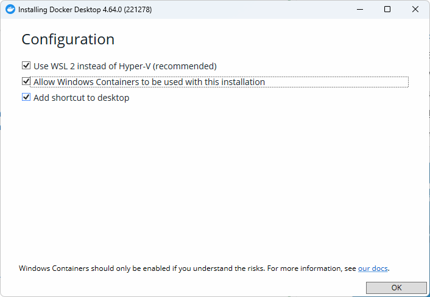
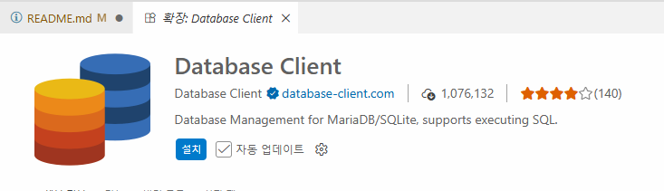
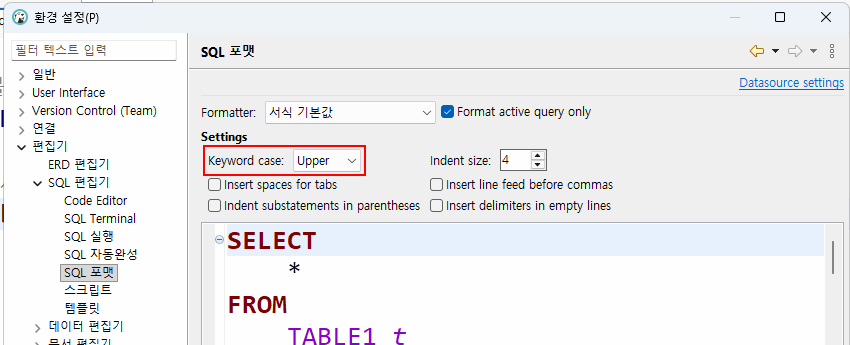
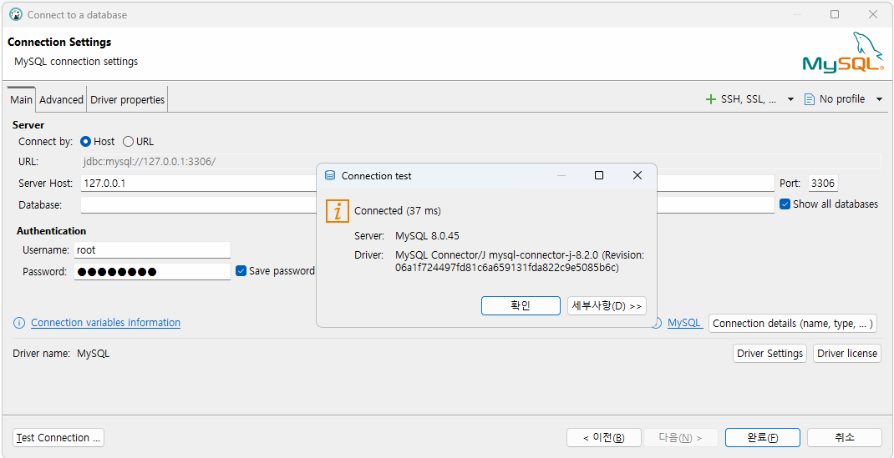
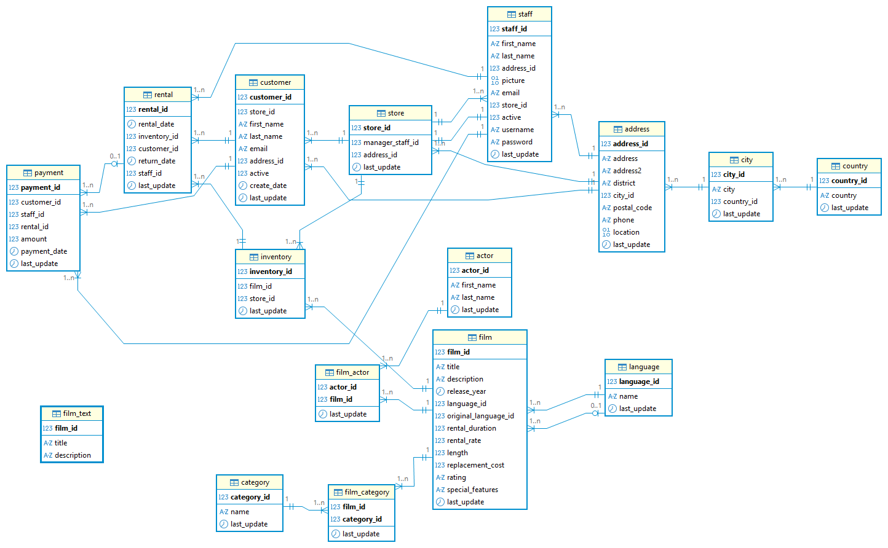
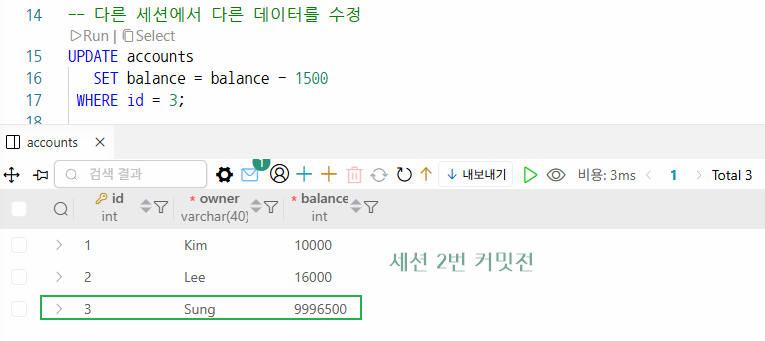
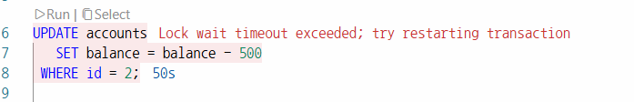
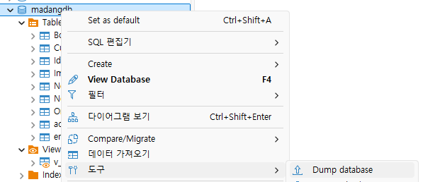
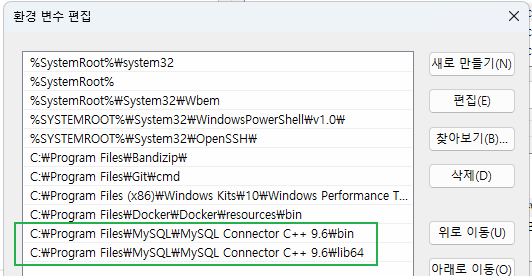
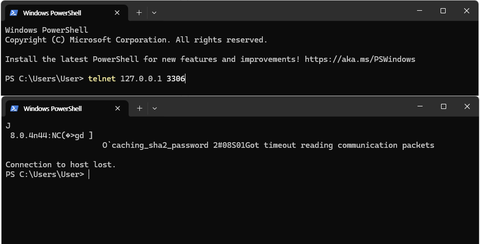

# iot-database-2026
IoT 개발자 데이터베이스 리포지토리

## 1일차


### 데이터/정보/지식

- `데이터`(Data): 단순한 수치나 값
- `정보`(Information): 데이터의 의미를 부여한 것
- 지식(Knowledge): 정보를 통한 사물이나 현상에 대한 이해


### 데이터베이스(DataBase)

- 조직에 필요한 정보를 얻기 위해 논리적으로 연관된 데이터를 모아 구조적으로 통합, 저장해 놓은 것.
- `도메인`(Domain): 자기 업무에 관련된 지식
- 기업/기관은 자기 도메인 정보만 저장. (공공데이터포털: https://www.data.go.kr/index.do)
- 보통 CS(Client - Server) 프로그램이라고 명칭. DB쪽이 서버, 프로그램쪽이 클라이언트.

#### 데이터베이스 개념

- 통합 데이터 - `데이터 중복 최소화`, 중복으로 인한 데이터 `불일치 현상 제거`.
- 저장 데이터 - 문서가 아닌 `컴퓨터 저장장치에 저장.` 반영구적 저장.
- 운영 데이터 - 저장된 상태에서 검색, 수정 등 `업무를 위해 사용.`
- 공용 데이터 - 여러 사람이 업무를 위해서 `공동으로 사용.`

#### 데이터베이스 특징

- 실시간 접근성 - 수 초내 결과 리턴.
- 계속적 변화 - 추가, 수정, 조회, 삭제 가능.
- 동시 공유 - 여러 사용자가 동시에 공유. 같은 데이터를 사용하더라도 최대한 문제 없게 처리.
- 내용에 따른 참조 - 물리적인 저장 데이터가 아닌, 데이터값을 참조.

#### DBMS(DataBase Management System)

- DBMS: 데이터베이스를 관리하는 시스템
- `DBMS`를 데이터베이스, DB로 통칭.

#### DBMS 장점

- `데이터 중복 최소화`, `데이터 무결성 유지`, 데이터 일관성, 데이터 독립성, 관리 기능(백업, 복구, `동시성제어`, 계정, 보안), 개발 생산성, 데이터 표준 준수 등.


### 데이터베이스 설치

#### 로컬 설치

1. https://www.mysql.com/ 사이트 - 다운로드 메뉴
2. MySQL Community Edition 아래 링크 클릭
3. MySQL Installer for Windows 링크 클릭
4. MySQL Installer 8.0.45 -  Windows (x86, 32-bit), MSI Installer 500M 이상 다운로드
5. 회원가입이나 로그인 없이 No thanks, just start my download. 클릭
6. mysql-installer-community-8.0.45.0.msi 실행

    

    

    

7. 일반적인 프로그램 설치와 동일

#### 도커사용 설치

- `Docker`: 애플리케이션 신속 구축, 테스트, 서비스할 수 있는 `컨테이너 기반의 가상화 플랫폼`
    - 온라인 상에서 이미지를 다운로드(Pull)
    - 실행하는 컨테이너로 만듦(Run)

1. 도커 설치
    - https://www.docker.com/ 사이트 - Download Docker Desktop 클릭
    - Docker Desktop Installer.exe 실행
    
     

    

    - Close And Restart로 재부팅
    - Docker Subscription Service Agreement 창 Accept 클릭
    - Linux용 Windows 하위 시스템 설치 필수, `wsl --update` 실행

2. 도커 설정
    - 설정 > Start Docker Desktop when you sign in to your computer 체크

3. 도커 콘솔 명령어
    ```powershell
    > docker
    > docker --version
    > docker search 이미지명
    > docker pull 이미지명
    > docker run
    ...
    ```

4. MySQL 설치
    - Powershell 열기
    - docker search 는 도커허브 검색 기능

    ```powershell
    > docker search mysql
    ```
    - docker pull 이미지 다운
    
    ```powershell
    > docker pull mysql:8.0.45
    ```

    

    - docker run: 컨테이너 실행

    ```powershell
    # \는 윈도우에서 사용불가, 여러줄 명령 불가능.
    > docker run -d --name mysql80 -p 3306:3306 -e MYSQL_ROOT_PASSWORD=my123456 -e MYSQL_DATABASE=mydb -e MYSQL_USER=myuser -e MYSQL_PASSWORD=my123456 -v mysql80_data:/var/lib/mysql --restart unless-stopped mysql:8.0.45
    ```

    - 필요 계정
        - root(관리자): my123456
        - myuser(일반사용자): my123456

    - 옵션 설명
        - `--name mysql80`: 컨테이너 이름
        - `-p 3306:3306`: 포트번호(컴퓨터에서 접근하는 포트:컨테이너 내부 포트)
        - `MYSQL_ROOT_PASSWORD`: Mysql 관리자 root계정 비밀번호 초기화
        - `MYSQL_DATABASE`: 컨테이너 시작시 자동 생성할 DB 
        - MYSQL_USER / MYSQL_PASSWORD: 일반 사용자 계정
        - -v mysql80_data:/var/lib/mysql: 컨테이너 내 mysql 데이터 저장위치
        - --restart unless-stopped: 도커 재시작시 자동복구

    - docker ps: 현재 실행중인 컨테이너 확인
    
    - docker exec: 도커 컨테이너 내부 접속
    ```powershell
    > docker exec -it mysql80 mysql -u root -p
    Enter password : 
    ```

5. MySQL Workbench 설치

    - Database 개발툴 / MySQL 기본툴
    - 로컬에서 다운로드한 MySQL Installer 8.0.45.exe 실행
    - MySQL Connections 옆 동그라미 플러스 아이콘 클릭

    

    

6. `DBeaver` Community Edition 개발툴 설치

    - https://dbeaver.io/ 다운로드
    - Download EXE 클릭
    - 일반적인 프로그램 설치와 동일

7. Visual Studio Code DB 확장 설치

    

     - 확장 > Database 검색
    - Database Client 설치
    - Database 아이콘 클릭 > `Create Connection` 버튼 클릭

    

#### MySQL 접속

- 관리자계정 - root
    - 새 사용자 생성, 새 데이터베이스 생성, 권한, 백업 및 복구
- 일반계정 - myuser, madang
    - 해당 데이터베이스에서 데이터 처리 작업


### 기본 이론

#### 관계형 데이터베이스

- Relational Database
    - 1969년 E.F Codd 수학 모델에 근간해서 고안
    - 테이블을 최소단위로 구성
    - 각 테이블간 관계를 통해서 데이터모델 구성

#### 데이터베이스 종류

- `관계형 데이터베이스`
    - Oracle, SQL Server(MS), `MySQL`(Oracle), MariaDB, PostgreSQL(오픈소스)
- NoSQL 데이터베이스
    - MongoDB, Redis, Apache Cassandra ...
- In-memory 데이터베이스    
    - SAP HANA ...

#### SQL

- Structured Query Language
    - `구조화된 질의 언어`
    - 데이터베이스에서 데이터를 조작하고, 테이블과 같은 객체를 컨트롤하는 등의 작업을 수행하는 프로그래밍 언어

- SQL 종류
    - DML(Data Mnipulation Language): 데이터 조작어
        - `SELECT, INSERT, UPDATE, DELETE` 등 - 데이터를 조작하는 언어
    - DDL(Data Definition Language): 데이터 정의어
        - `CREATE, ALTER, DROP`, RENAME 등 - 객체(데이터베이스, 테이블, 사용자, 뷰, 인덱스 등)를 처리하는 언어    
    - DCL(Data Control Language): 데이터 제어어   
        - `GRANT, REVOKE` - 사용자에게 권한을 주고 해제하는 기능을 처리하는 언어
    - TCL(Transaction Control Language): 트랜잭션 제어어
        - `START TRANSACTION, COMMIT, ROLLBACK`, SAVEPOINT 등 - 트랜잭션 처리로 동시성 제어를 위한 언어     


### SELECT 실습

- DBeaver 설정
    - 환경설정 > 편집기 > SQL 편집기 > SQL 포맷
    - keyword case UPPER로 변경

    

- 기본문법

    ```sql
    -- 기본 조회 쿼리, * → '올'이라고 호칭. ALL 키워드와 다름.
    SELECT *
     FROM 테이블명;

    -- 컬럼(열) 명시할 때, 열 순서를 바꿔서 조회할 때.
    SELECT 컬럼1, 컬럼2, ... 컬럼n
      FROM 테이블명;

    -- 조건 필터링(필요한 행/레코드)만 조회할 때
    SELECT *|컬럼명 나열
      FROM 테이블명
     WHERE 조건 ... ;

    -- 정렬
    -- ASCending(오름차순) | DESCending(내림차순)
    -- ASC는 기본이므로 생략 가능
    SELECT *|컬럼명 나열
      FROM 테이블명
     WHERE 조건 ...   (없어도 됨)
     ORDER BY 컬럼1, 컬럼2 ASC|DESC;
    ```


## 2일차


### 도커 사용하는 이유

- 설치 편의성 - 이미지만 있으면 컨테이너로 실행하는데 수십초에 불과함. 설치설정 불필요.
- 환경격차 문제 해결 - OS단의 설정까지 건드려야 하는 문제를 없애고, 간단하게 서비스 실행 가능.
- 서버비용 절감 - 새로운 서비스를 할 때마다 하드웨어 서버를 구매/설정할 필요 없음.
- OS에 독립적 - 새로운 서비스의 운영OS에 따라사 새로 설치할 필요 없음. 
- 가상머신보다 빠름. - VMWare, VirtualBox와 같은 가상OS머신보다 실행속도 빠름. 가상OS에서 필요없는 기능 제거, 용량 축소.


### AI시대 PostgreSQL 학습

- DB시장에서 Oracle, MySQL, 다음 PostgreSQL이 4위.
- AI시대에 더 비중이 오름. → 나중에 학습할 것.


### DBeaber 접속설정 다시

- Public Key Retrieval is not allowed 라는 경고메시지로 접속불가할 때

    

- Driver properties 탭 `allowPublicRetrieval` 키를 `true`로 변경

    


### SELECT 실습

#### 기본문법 [쿼리](./day02/1.SELECT기본.sql)

    ```sql
    SELECT ALL|DISTINCT 컬럼1, ...
      FROM 테이블명
     WHERE 필터링조건
     GROUP BY 그루핑컬럼1, 컬럼2...
     HAVING 집계함수 필터링 조건
     ORDER BY 컬럼1, 컬럼2 DESC;
    ```

#### 필터링

- WHERE 절 - 전체 데이터에서 필요한 것만 필터링

    - 비교: =(같다), <>(같지 않다), !=(Db종류별로), <, >, <=, >=
    - 범위: BETWEEN a AND b
        - 주의: `초과/미만 사용불가`, `날짜 조심할 것!`
        - price BETWEEN 10000 AND 20000
    - 집합: IN, NOT IN 
        - price IN (10000, 20000) - 가격이 1만, 2만에 속하는 데이터
        - price NOT IN (10000, 20000) - 가격이 1만, 2만을 제외한 나머지 데이터
    - 패턴: LIKE(문자열만), %, _
        - bookname LIKE '축구%' -- 책 제목중 축구로 시작하는 책 모두 
    - `NULL`: IS NULL, IS NOT NULL(데이터가 없는 것, 입력되지 않은 것)
        - = 로 비교하지 않음. ~~WHERE price = null~~
        - price IS NULL, price IS NOT NULL
    - 복합조건: AND(C++ &&와 동일), OR(C++ ||), NOT(C++ !)로 비교를 조합
        - (price < 20000) AND (bookname LIKE '축구의%')

- ORDER BY - 정렬 ASC(오름차순), DESC(내림차순)

#### 별명

- Alias - 별명으로 컬럼명, 테이블명 등 원래의 이름을 바꿔쓰고 싶을 때 AS 사용
    - "" 쌍따옴표로 별멍을 지정하는 것을 추천(스페이스사용 등)

#### 그룹화 및 집계함수

- GROUP BY - 집계(통계)함수 - DB를 사용하는 가장 큰 목적 중 하나
    - SUM(): 총합 - 숫자컬럼만
    - COUNT(): 총 개수 - 컬럼 대신 * 가능
    - MIN(): 최소값 - 숫자컬럼만
    - MAX(): 최대값 - 숫자컬럼만
    - AVG(): 평균값 - 숫자컬럼만
    - STD(): 표준편차 - 숫자컬럼만

- HAVING - 일반 필터링은 WHERE 절로, `집계함수 필터링은 HAVING` 절로.

- GROUP BY, HAVING `주의사항`
    - GROUP BY에 포함되지 않은 컬럼은 SELECT에 사용할 수 없음!
    - 집계함수 외 일반컬럼은 SELECT와 GROUP BY를 일치시킬 것
    - HAVING 절에는 집계함수 필터링 포함
    - WHERE 절에 집계함수 사용불가!
    - SELECT, FROM, WHERE, GROUP BY, ORDER BY 순으로 기억

#### 조인

- `JOIN` - 관계형 DB의 핵심기능 - [쿼리](./day02/3.JOIN.sql)
    - 두 개 이상의 테이블을 합쳐서 하나의 테이블처럼 보여주는 기법

    

- JOIN 종류 - 종류는 많으나 3가지만 알면 됨
    - INNER JOIN(내부조인) - 조인중에서 가장 간단한 조인. 컬럼이 일치하는 데이터만 조회. 
        - 기준테이블이 없음. 조인 되는 테이블간의 관계 확인.
    - OUTER JOIN(외부조인) - 한 테이블을 기준으로 데이터가 일치하지 않는 데이터까지 나오도록 조회하는 조인.
        - LEFT OUTER JOIN - 두 개의 테이블 중 앞쪽 테이블 기준
        - RIGHT OUTER JOIN - 두 개의 테이블 중 뒤쪽 테이블 기준

#### 서브쿼리(부속질의)

- SubQuery - 쿼리 내부에 포함되는 하위쿼리. 항상 소괄호 () 내에 작성 - [쿼리](./day02/4.SUBQUERY.sql)
    - 소괄호 안의 쿼리부터 먼저 작성
    - 메인쿼리 - 소괄호 밖의 쿼리
    - 서브쿼리 - 소괄호 안의 쿼리
    - 대부분이 조인으로 변경 가능
    - 조인을 많이 사용한다면, 서브쿼리는 필요할 때만 사용
        - 조인이 가지고 있는 성능개선의 특징을 사용 못하기 때문에 속도저하 발생 가능성 높음


## 3일차


### SELECT 실습

- DB 문자열, 숫자, 날짜/시간만 고려만 됨

#### 서브쿼리 계속

- 서브쿼리 종류 - [쿼리](./day03/1.SUBQUERY.sql)
    - WHERE절 서브쿼리
    - FROM절 서브쿼리
    - SELECT절 서브쿼리

#### 집합연산

- 두 테이블 합치기 - [쿼리](./day03/2.UNION.sql)
    - UNION - 중복제거 합집합
    - UNION ALL - 중복표시 합집합

#### GROUP BY 추가기능

- GROUP BY 컬럼 WITH ROLLUP - 전체 합산 추출 [쿼리](./day03/3.ROLLUP.sql)
    - ROLLUP을 안 쓰면 쿼리가 아주 길어짐


### DML 기타

- DML 중에서 직접적인 트랜잭션 영향을 받지 않는 것은 SELECT 뿐

#### INSERT

- [쿼리](./day03/4.DML기타.sql)
- 테이블에 데이터를 삽입하는 쿼리
- 트랜잭션의 영향을 받음 

    ```sql
    INSERT INTO 테이블명 (컬럼1, ... 컬럼n)
    VALUES (컬럼1값, ..., 컬럼n값);
    ```

- UPDATE나 DELETE와 달리 큰 문제가 발생하지 않음
    - 잘못 입력하면 지우면 됨

#### UPDATE

- 테이블에 존재하는 데이터를 수정하는 쿼리
- 트랜잭션의 영향을 받음
- 수정은 매우 신중

    ```sql
    update 테이블명
       set 변경컬럼1 = 변경값1
         , 변경컬럼2 = 변경값2
         , ...
         , 변경컬럼n = 변경값 n
      WHERE 구분컬럼 = 구분값;    
    ```

#### DELETE

- 테이블에 존재하는 데이터를 삭제하는 쿼리
- 트랜잭션의 영향을 받음
- 삭제는 매우 신중

    ```sql
    DELETE FROM 테이블명
     WHERE 구분컬럼 = 구분값!
    ```


### DDL
- Data Definition Language
- 객체 생성하고 수정, 삭제하는 기능을 하는 SQL 언어

#### MySQL 데이터타입

- `BOOL` - true/false
- TINYINT, SMALLINT - 1byte(255까지), 2byte
    - `TINYINT(1)` - 1/0
- `INT` - 4byte(가장 기본)
- `BIGINT` - 8byte
- FLOAT - 4byte 소수점
- DOUBLE - 8byte, 예전에 많이 사용
- `DECIMAL(m, n)` - m 전체 65자리수, n 소수점 최대 30자리수
    - 정수가 35자리, 소수점 30자리인 아주 큰 수
    - 현재 가장 많이 사용되는 숫자타입
- DATE - 날짜만 2026-03-17
- `DATETIME` - 날짜와 시간 모두 2026-03-17 16:28:56.00
- CHAR(n) - 고정길이 문자열 n만큼 길이 지정
    - CHAR(10)에 'Hello' 입력하면 'Hello_____' 로 저장
    - 나머지 5자리 스페이스로 채움
    - 주민번호, 공통코드처럼 정확한 길이 입력 필요할 때
- VARCHAR(n) - 가변길이 문자열 n만큼 길이 지정
    - VARCHAR(10)은 'Hello' 로 저장. 나머지 5자리는 없앰
    - char, varchar는 길이를 여유있게 설정해야 함
        - 길이를 넘어서는 문자열은 입력되지 않음(잘림)
- `TEXT`, LONGTEXT - 아주 긴 문자열, 2~4GB
- `BLOB` - 바이너리로 저장되는 큰 데이터, 2~4GB

#### CREATE

- DB객체를 생성하는 쿼리 - [쿼리](./day03/5.DDL.sql)
- 데이터베이스, 테이블, 뷰, 인덱스 등 주요 객체를 생성가능

    ```sql
    -- 테이블 생성
    CREATE TABLE 테이블명 (
        컬럼1이름 데이터타입 제약조건,
        컬럼2이름 데이터타입 제약조건,
        ...
        컬럼n이름 데이터타입 제약조건,
        [각 제약조건 독립적으로 작성]
    );
    -- 데이터베이스 생성
    CREATE DATABASE 데이터베이스명;
    -- 사용자 생성
    CREATE USER 사용자명 IDENTIFIED BY 비번;
    -- ...
    ```


## 4일차


### MySQL 샘플DB

- 샘플DB 
    - https://dev.mysql.com/doc/index-other.html?ref=dbwriter.io
    - https://www.mysqltutorial.org/getting-started-with-mysql/mysql-sample-database/

- `Sakila`(영화 대여 DB) - [쿼리](./ref/sakila-schema-safe.sql)
    - Data - [쿼리](./ref/sakila-data.sql)


### DML 추가

- INSERT INTO 대량 삽입 - MySQL 방법 - [쿼리](./day04/1.INSERT추가.sql)

    ```sql
    INSERT INTO 테이블명 VALUES (컬럼1값, 컬럼2값, ... 컬럼n값),
    (컬럼1값, 컬럼2값, ... 컬럼n값),
    (컬럼1값, 컬럼2값, ... 컬럼n값),
    ...
    (컬럼1값, 컬럼2값, ... 컬럼n값);
    ```

- SELECT TOP 3
    - 전체 조회 수중에서 조건에 맞는 데이터 3개만 조회


### DDL 계속

#### 제약조건 개요

- 데이터베이스에 정확한 데이터가 들어갈 수 있도록, 테이블 각 컬럼별 입력가능한 데이터를 지정하는 것
- 무결성을 벗어나는 데이터는 못 들어가도록 제약(제한)을 주는 것
- 종류: `기본키(Primary Key)`, 단일(Unique), 널허용여부(Null), 체크(Check), 기본값(Default), `외래키(Foreign Key)`

#### CREATE 계속

- CREATE 구문 - [쿼리](./day04/2.CREATE.sql)
    - PRIMARY KEY (컬럼1 또는 여러 개)
    - FOREIGN KEY (custid) REFERENCES NewCustomer(custid) ON DELETE CASCADE
        - REFERENCES: 참조하는 부모테이블과 PK컬럼
        - ON DELETE CASCADE: 무결성 유지를 위해서 부모테이블의 해당 PK데이터를 삭제하면 자식테이블 관련 FK데이터도 같이 삭제하는 옵션
        - ON DELETE SET NULL: 부모 테이블의 PK가 삭제되면, 자식 테이블의 FK값은 NULL로 변경
        - ON UPDATE: CASCADE | SET NULL: 수정할 때도 삭제시와 유사한 처리 가능. 수정도 가능하지만 PK 수정이 거의 없기 때문에 많이 사용되지 않음

- AUTO_INCREMENT: 테이블에 데이터 삽입할 때 숫자타입 PK의 값을 자동 증가시켜서 만들어주는 기능
    - PK 컬럼은 INSERT 문에서 생략

#### ALTER

- ALTER - [쿼리](./day04/3.ALTER.sql)
    - 객체 수정, 테이블 외에서는 많이 사용 안 됨
    
    ```sql
    ALTER TABLE 테이블명
        [ADD 속성명 데이터타입]
        [DROP COLUMN 속성명]
        [MODIFY 속성명 데이터타입]
        [MODIFY 속성명 [NULL|NOT NULL]]
        [ADD PRIMARY KEY(컬럼명)]
        [[ADD|DROP] 제약조건명]

    ```

#### DROP

- DROP
    - 객체 삭제
    - 테이블에서는 관계를 맺고 있는 자식테이블 먼저 삭제 후 부모테이블 삭제 가능

    ```sql
    DROP 객체 객체명
    ```

#### 내장함수

- C, C++ 내장함수와 동일 - [쿼리](./day04/4.내장함수.sql)


### NULL과 NULL 관련 함수

- 아직 지정되지 않은 값 - [쿼리](./day04/5.NULL.sql)
- '0', ' ' 과 다름
- C, C++의 '\0' 과 동일한 의미
- 비교연산 불가(=, >, <, >=, <=, !=) 대신 IS, IS NOT만 사용 가능
- NULL값을 연산하면 결과도 NULL이 됨
    - NULL + 숫자 => NULL
    - 집계함수 계산 시 NULL 포함된 행은 집계에서 빠짐(!)


### 쿼리연습

- [쿼리](./day04/7.Sakila_practice.sql)




## 5일차


### 쿼리연습

- [쿼리](./day05/1.Sakila_practice.sql)


### 뷰

- VIEW - [쿼리](./day05/2.VIEW.sql)
    - 편리성과 재사용성: 일반 테이블처럼 사용하고, 여러 번 사용 가능
    - 보안성: 개인정보와 같은 민감한 데이터의 공개를 막을 수 있음
    - 독립성: 일반 테이블처럼 사용, 사용자가 필요한 정보만 가공. 원본 테이블을 변경할 필요 없음

- 특징
    - 실제 데이터가 아님. 원본 데이터가 바뀌면 뷰 데이터도 갱신
    - 독립적인 인덱스 생성 어려움(속도 개선 어려움)
    - 뷰이지만 데이터 INSERT, UPDATE 등이 가능
    - INSERT, UPDATE, DELETE는 거의 불가
    - 뷰는 보기 위해서 생성하므로 SELECT 이외 DML은 자제할 것. 거의 사용 X

    ```sql
    -- 생성과 수정
    Create OR REPLACE VIEW 뷰이름 AS
    SELECT 구문;

    -- 삭제
    DROP VIEW 뷰이름;
    ```

### 인덱스

- INDEX - [쿼리](./day05/3.INDEX.sql)
    - 책 뒤편 찾아보기, 인덱스와 동일한 역할
    - 테이블에 하나 이상 설정 가능('인덱스를 건다'라고 부름)
    - 인덱스가 없으면 `Full Table Scan`, 인덱스가 있으면 `Index Range Scan` 으로 변경
    - 내부적으로 B-Tree 자료구조 사용, $ 0(logN) $

    ```sql
    -- 인덱스 생성
    CREATE [UNIQUE] INDEX 인덱스명 ON 테이블명(컬럼명, ... [ASC|DESC]);

    -- 인덱스 삭제
    DROP INDEX 인덱스명 ON 테이블명;
    ```

- 인덱스 종류
    - 기본키 인덱스: Primary키에 자동으로 걸리는 인덱스. 클러스터 인덱스
    - UNIQUE 인덱스: Unique 제약조건의 컬럼에 걸 수 있는 인덱스, NULL은 허용하는데 데이터 중복은 불가
    - 일반 인덱스: 중복허용, 인덱스 효과 미흡
    - 복합 인덱스: 두 개 이상의 컬럼을 하나의 인덱스로

- 인덱스 구분
    - 클러스터 인덱스: 테이블당 하나만 생성. 데이터 자체가 정렬되는 것. 
        - 최초 PK나 PK가 없는 테이블에서는 첫번째 UNIQUE 인덱스 (ex 디비버 테이블 데이터 자동정렬)
    - 넌클러스터 인덱스: 여러 개 가능. 
        - 인덱스가 데이터 따로 생성 (ex 책 뒤에 인덱스 정리된 거)
        - 클러스터 인덱스 생성 후 모든 인덱스가 전부 넌클러스터 인덱스

- `인덱스 주의사항`
    - 인덱스를 생성한다고 무조건 속도가 빨라지는 것은 아님. 제대로 걸어야 함
    - WHERE절에 자주 사용되는 컬럼에 인덱스를 걸어야 함 (PK에 자동으로 인덱스 생성)
    - JOIN에 사용되는 FK에도 인덱스를 걸면 속도 개선
    - 단일 테이블에 인덱스를 너무 많이 걸면 반대로 속도가 느려짐(테이블당 4개정도 인덱스 권장)
    - 인덱스마다 ASC, DESC로 정렬해야하기 때문에 부가적인 처리가 많아짐
    - 자주 변경, 삭제되는 컬럼에 인덱스를 걸지 말 것
    - 중복이 많이 되거나, NULL이 많은 컬럼은 인덱스효과 미비


### SELECT문 추가 기능

#### CTE

- Common Table Expression: 공통으로 쓸 수 있는 테이블 표현기법 - [쿼리](./day05/4.CTE.sql)
    - 여러 곳에서 공통으로 사용할 임시 테이블형태 쿼리
    - 이름을 지정하는 임시 테이블
    - 쿼리를 깔끔하게 생성
    - 쿼리 실행동안 재사용
    - 가상 데이터를 생성할 때

    ```sql
    WITH cte이름 AS (
        SELECT ...
    )
    SELECT *
      FROM cte이름;
    ```


## 6일차


### 트랜잭션, 동시성제어

- TCL
    - Transaction Control Language에 포함된 `START TRANSACTION`, `COMMIT`, `ROLLBACK`, `SAVEPOINT` 학습

#### Transaction

- `트랜잭션`
    - 일을 처리하는 논리적인 단위 그룹
    - 여러 쿼리들이 실행되어 완성되는 하나의 논리 그룹처리 단위

- 계좌이체 예시 - A가 B에게 100만원을 보낸다
    1. A의 계좌에서 100만원 차감
    2. B의 계좌에 100만원 추가
    3. 1번만 실행되고, 2번이 실패하면 돈이 사라짐(X)
    4. 2번만 실행되고 1번이 실패하면,ㅣ 돈이 복사됨(X)

- 트랜잭션 4가지 특징(`ACID`)
    - 원자성(Atomicity): 전부 성공 or 전부 실패(ALL or Nothing). 중간 상태 없음
    - 일관성(Consistency): 처리 전후로 데이터 규칙이 유지됨. 전체 합은 변경 없음
    - 격리성(Isolation): 여러 사람이 동시에 처리해도 서로 영향이 없음  
    - 지속성(Durability): 성공한 처리는 절대 사라지지 않음

#### DBeaver 툴 트랜잭션 설정

- DBeaver가 기본적으로 트랜잭션을 사용 못하게 되어 있음. - Auto Commit 설정 중

    

    - Manual Commit으로 변경 후 테스트

- 환경설정 > 연결 > 연결 유형 아래 `Auto-commit by default` 체크 해제 -> 트랜잭션 사용 모드

    

    - 단, Auto-commit을 끄면 SQL에디터마다 커밋, 롤백을 물어봄

- 트랜잭션 모드 > Smart commit mode 체크
    
     

    - Smart commit mode가 활성화 안 되면 단순 SELECT 쿼리만 실행해도 트랜잭션이 걸림
    - 불편함을 없애기 위해서 Smart commit mode를 활성화, 사용할 것

#### 트랜잭션 쿼리

- 기본 - [쿼리](./day06/1.TRANSACTION.sql)
    ```sql
    START TRANSACTION; -- 1.트랜잭션 로직에 진입

    -- 여러 가지 쿼리 실행

    COMMIT; -- 2.성공했으면 모두 저장!
    ROLLBACK; -- 3.실패했으면 원상복구
    ```

- 세이브포인트 - [쿼리](./day06/2.SAVEPOINT.sql)
    ```sql
    -- 트랜잭션 중
    SAVEPOINT sp명;

    -- .. 오류가 발생하면
    ROLLBACK TO sp명;

    COMMIT;
    ```

#### 동시성 제어

- 개요
    - 여러 트랜잭션이나 프로세스가 동시에 실행될 때 데이터의 일관성을 유지하면서 처리하는 것
    - Lock, Isolation Level, MVCC 등 동시성 제어 기법 사용

        

        

- 행 단위 락(Row Lock) - 일반적인 락 - [쿼리1](./day06/3.동시성제어_세션1.sql), [쿼리2](./day06/4.동시성제어_세션2.sql)
    - 세션 1번이 특정 테이블의 데이터를 UPDATE, DELETE 할 때 트랜잭션을 종료하지 않으면
    - 세션 2번이 같은 테이블의 데이터를 UPDATE나 DELETE 할 수 없음

    - 락 걸린 상태
    

    - 50초 후 락 상태 해제
    

    - 서로 다른 행 데이터를 편집할 때는 락이 걸리지 않음

- 테이블 락(Table Lock) 
    - 테이블 전체를 락, 행 락과 달리 COMMIT, ROLLBACK을 처리할 수 없음
    - 언락으로 테이블 락을 해제해야 함
    - 데드락 5분 가량 지속

- `격리수준` - 동시에 여러 트랜잭션이 실행될 때 서로의 데이터에 얼마나 영향을 줄지 제어하는 기준
    - 최하 - Read Uncommitted. 커밋되지 않은 데이터 읽을 수 있음(사용 안 함)
    - 중간 - Read Committed. 커밋된 데이터만 읽음
    - 기본 - `Repeatable Read`. MySQL 기본값. 같은 트랜잭션 안에서는 항상 같은 결과
    - 최고 - Serializable. 순차적 실행. 동시성 거의 없음. 안전하지만 성능 최악    

- 동시성 제어문제
    - Dirty Read - 다른 트랜잭션이 아직 커밋하지 않은 데이터를 읽는 현상
    - Non-repeatable Read - 같은 트랜잭션 안에서 같은 데이터를 두 번 읽었을 때 결과가 다른 현상
    - Phantom Read - 같은 조건으로 두 번 조회시, 행 개수가 달라지는 현상

- 격리수준과 동시성 제어 정리

    |격리수준|Dirty Read|Non-Repeatable Read|Phantom Read|
    |:--|:--:|:--:|:--:|
    |Read Uncomitted|가능|가능|가능|
    |Read Comitted|방지|가능|가능|
    |`Repeatable Read`|방지|방지|일부 방지|
    |Serializable|방지|방지|방지|

- 데드락
    - MySQL은 데드락이 오래 걸리지 않도록 50초 후 데드락을 풀어버림
    - 트랜잭션이 종료된 것은 아니므로 다른 세션에서 COMMIT, ROLLBACK을 수행해야 함
    - 트랜잭션을 짧게 유지할 것
    - 테이블 락은 사용 최소화

- 트랜잭션 확인 쿼리(관리자용)
    ```sql
    SELECT * FROM information_schema.INNODB_TRX it;
    ```    

### 보안 및 관리

#### 사용자

- 사용자 생성 및 삭제 - [쿼리](./day06/5.USER_GRANT.sql)
    - 데이터베이스를 사용할 계정 생성 쿼리, DDL
    - @이후 'localhost' 내부접속용. '%' 외부접속용

    ```sql
    -- 사용자 생성
    CREATE USER '사용자명'@'localhost|%' IDENTIFIED BY '비밀번호';
    
    -- 사용자 비밀번호 변경
    ALTER USER '사용자명'@'localhost|%' IDENTIFIED BY '비밀번호';
    
    -- 사용자 삭제
    DROP USER '사용자명'
    ```

#### 권한

- 사용자에게 권한 부여 및 해제, DCL
    - 대부분 관리자가 수행
    - GRANT, REVOKE

    ```sql
    -- 권한 부여
    GRANT ALL PRIVILEGES ON 데이터베이스.* TO '사용자명'@'localhost|%';

    -- 특정권한 부여
    GRANT SELECT, INSERT, UPDATE ON 데이터베이스.객체명 TO '사용자명'@'localhost|%';

    -- 권한 해제
    REVOKE ALL PRIVILEGES ON 데이터베이스.* FROM '사용자명'@'localhost|%';
    ```

#### MySQL 백업 복구

- dump, restore
    - *.sql 파일로 내보내기 - [쿼리](./day06/dump-madangdb-202603201615.sql)

    


### MySQL 프로그래밍


### 데이터베이스 프로그래밍

- 각 DB마다 프로그래밍 언어가 상이
    - Oracle: `PL/SQL`
    - SQL Server: T-SQL
    - My SQL : My SQL Programming

- 일반 프로그래밍 언어와 차이점 존재
    - DB 전용 프로그램 개발

- DBeaver SQL 에디터로 프로시저, 함수등이 잘 생성되지 않음
    - DBeaver에 있는 전용 생성 위저드로 진행!

- 개념
    - 일반적인 프로그래밍과 유사
    - 변수, 연산자, 조건문, 반복문 모두 존재    

- MySQL의 경우 함수 안정성 체크옵션으로 생성 불가 발생
    - 관리자에서 실행

    ```sql
    -- 함수 안정성 체크 안함
    SET GLOBAL log_bin_trust_function_creators = 1;
    ```

#### 사용자 정의 함수

- 함수 - [쿼리1](./day06/6.FUNCTION.sql), [쿼리2](./day06/7.FUNCTION_원형.sql)
    - 내장 함수에 없는 기능의 함수를 추가로 개발하는 것
    - 함수 파라미터, 리턴값이 존재
    - 일반 쿼리문에 포함 가능

- 생성
    - DBeaver 해당 DB Procedures 폴더에서 마우스 오른쪽 버튼 > Create New Procedure
    - Name, 필요한 함수명 입력
    - Type, FUNCTION 선택

    

    - 작성 후 Save 클릭(Execute)


## 7일차


### MySQL 프로그래밍

#### 저장 프로시저

- 저장 프로시저 - [쿼리1](./day07/1.PROCEDURE_원본.sql), [쿼리2](./day07/1.PROCEDURE_실행.sql)    
    - 함수와 달리 리턴값이 없음, 단 OUT 파라미터로 결과를 돌려받을 순 있음(리턴과 유사)
    - 일반 쿼리문에 포함해서 실행 불가
    - 단독 실행 또는 스케줄에 따라 배치 실행시
    - 사용자 없는 새벽에 `대량처리` 수행할 때

- 생성
    - DBeaver 해당 DB Procedures 폴더에서 마우스 오른쪽 버튼 > Create New Procedure
    - Name, 필요한 프로시저명 입력
    - Type, PROCEDURE 선택
    - 작성 후 Save 클릭(Execute)

#### 커서

- Cursor - [쿼리1](./day07/1.PROCEDURE_원본.sql), [쿼리2](./day07/1.PROCEDURE_실행.sql)
    - 마우스 커서와 동일하게 테이블의 한 위치를 가리키는 객체
    - 테이블의 데이터를 한 행씩 처리하기 위해서 사용
    - CURSOR, OPEN, FETCH, CLOSE
    - 일반 프로그래밍 언어와 연동시 사용

#### 트리거

- Trigger - [쿼리1](./day07/2.TRIGGER_원형.sql), [쿼리2](./day07/2.TRIGGER.sql)
    - 방아쇠를 뜻함. 하나의 테이블에서 INSERT, UPDATE, DELETE 문이 실행되면 다른 테이블이나 다른 처리가 자동으로 실행되는 저장 프로그램 중 하나
    - Before Trigger 보다 After Trigger가 더 많이 사용됨
    - 시스템 로그 기능에 많이 사용됨

    


### 데이터베이스 모델링

#### 모델링

- 개요
    - 현실세계에 존재하는 시스템을 컴퓨터 시스템으로 변환하기 위한 디자인
    - 현실세계의 데이터를 DB상에 입력해서 프로그램에서 사용할 수 있도록 설계
    - 현실세계 데이터 = DB상 데이터
    - 예) 오프라인 매장 -> 온라인 매장, 시립도서관 -> 온라인 시립도서관, 백화점 -> 모바일 백화점

- 데이터베이스 생성주기
    - `요구사항 수집 및 분석` > `설계` > `구현` > 운영 > 감시 및 개선

- SW 생명주기
    - DB 생명주기 설계, 구현이 SW 생명주기 설계에 속함
    - `요구사항 수집 및 분석` > `설계` > 구현 > 테스트 > 배포 > 유지보수/관리

- DB 설계 순서
    1. 개념 모델링: 요구사항에 따른 개념적인 모델링으로, 추상적인 도형으로 관계 구성
        - 전체적인 뼈대를 만드는 과정
        - 각 테이블이 될 `엔티티` 추출
        - 테이블의 컬럼이 될 속성 추출
        - 속성 구분자가 될 키 추출
    2. `논리 모델링`: 개념 모델링 바탕으로 속성, 키, 관계 명확히 정의
        - 개념 모델링에서 나오지 않았던 상세 속성들 추출(PK, FK, ...)
        - 데이터 중복을 최소화하는 `정규화` 수행
        - 관계형 데이터모델 테이블화, 구체화 
    3. `물리 모델링`
        - 실제 DB 종류(Oracle, `MySQL`, SQL Server)를 고려해서 설계
        - 테이블, 컬럼, 인덱스, 제약조건, 뷰 등 객체 및 PK, FK, NULL 등 제약조건 생성 
        - 성능을 위해 정규화된 내용을 다시 `반정규화` 진행
        - 최종 스키마 완성
        - 실제 데이터베이스화(내보내기 가능)

#### ERD 작성

- 정규화, 반정규화, 개념/논리/물리 다이어그램 


## 8일차


### 데이터베이스 모델링

#### ERD

- Entity Relationship Diagram


### C/C++ MySQL연동

- 개발방법
    - MySQL 8.0 이상
    - MySQL Connector/C++ 라이브러리 설치
    - Visual Studio 프로젝트 생성
    - C++ 코드 작성

#### MySQL Connect C/C++ 라이브러리

- https://dev.mysql.com/downloads/connector/cpp/
    - Windows (x86, 64-bit), MSI Installer 다운로드
    - C:\Program Files\MySQL\MySQL Connector C++ 9.6\ 에 설치됨

- 시스템속성
    - 고급 > 환경 변수 > path에 MySQL 관련 DLL이 위치하는 경로 추가
    - VS나 콘솔 재시작

    


### Visual Studio 프로젝트 속성

- 프로젝트 속성 (반드시! 부모 기본값 상속 체크)
    - C/C++ > 일반 > 추가 포함 디렉토리
        - C:\Program Files\MySQL\MySQL Connector C++ 9.6\include 추가
    - 링커 > 일반 > 추가 라이브러리 디렉토리
        - C:\Program Files\MySQL\MySQL Connector C++ 9.6\lib64\vs14 추가
    - 링커 > 입력 > 추가 종속성
        - mysqlcppconn.lib

#### 텔넷 클라이언트 설정

- 시작 > appwiz.cpl 실행
    - Windows 기능 켜기/끄기 클릭
    - Telnet Client 체크 활성화
    - powershell이나 콘솔

    


### 언어
C, C++, Python, SQL, C#, `Javascript, Html, CSS`, RaspPi, Arduino, IoT, 통신, ...